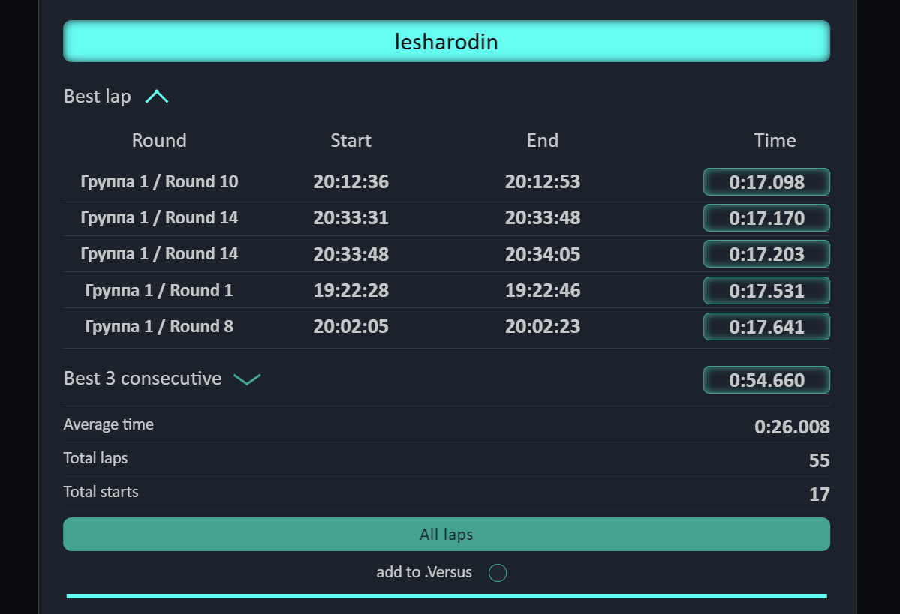
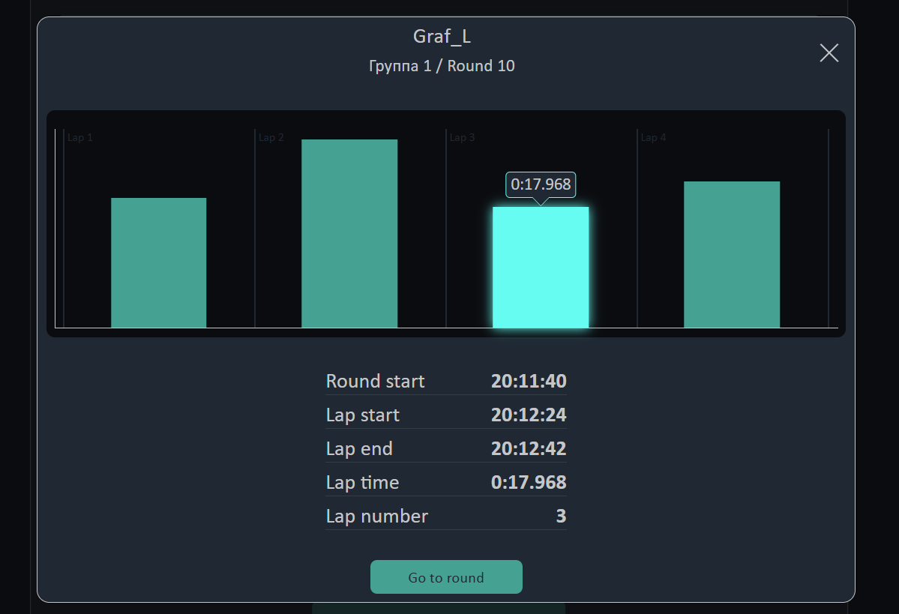
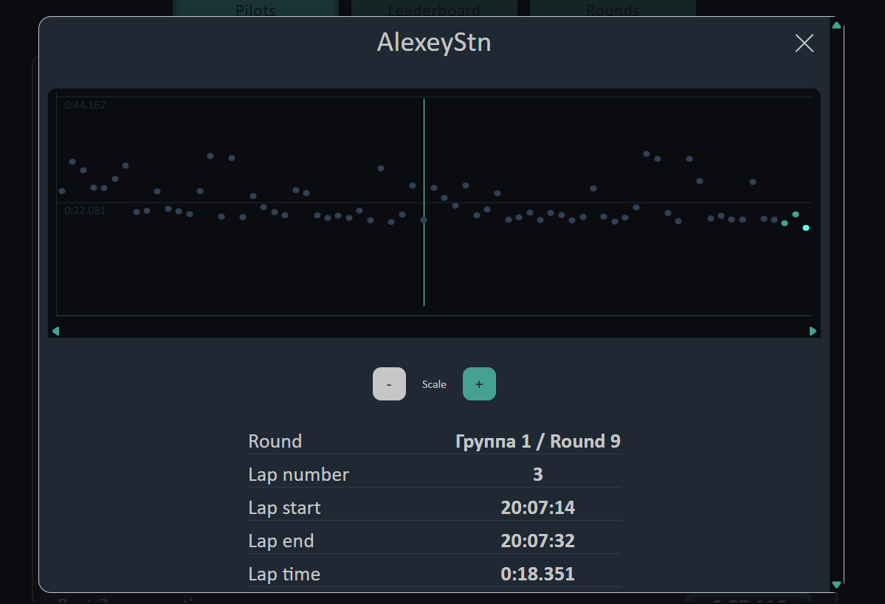

# RotorHazard Results Viewer

A static [web application](https://rh-results-viewer.vercel.app/) that visualizes lap timing data exported from RotorHazard's Results.json.

## Features
  - View top 5 best single laps and consecutive laps
  - Real-time clock (RTC) timestamps for easy DVR recording lookup
  - Individual pilot lap time graphs
  - Head-to-head pilot comparison statistics

## Live Demo

Access the live version hosted on Vercel:  
[View Live Demo](https://rh-results-viewer.vercel.app/)

## Project Background

Developed as part of my web development learning journey, this project focuses on core web technologies:

- HTML5
- CSS3 (with SCSS preprocessing)
- Vanilla JavaScript

Note: As a learning project, the codebase may not follow all enterprise-grade patterns.

## How to Use

1. Export your Results.json from RotorHazard
2. Open the [application](https://rh-results-viewer.vercel.app/) in your browser
3. Upload your results.json file in special form
4. Explore your race statistics!

- OR

1. Find [Telegram Bot](https://t.me/results_jsons_uploader_bot)
2. Send results.json with custom name in same message(example: WhoopMANIA Quals)
3. Wait for the Bot to send notification about success and Date
4. Find your event in calendar!

## Technical Details

- client-side processing (no server backend)
- Adaptive design (desktop & mobile compatible)
- Lightweight (~354 KB total resources)

## Future Improvements

- Live Timing Integration:
  - Real-time data connection via RotorHazard plugin (similar to FPVScores)
- Customization:
  - Adjustable number of displayed best laps (currently fixed at 5)

## Contributing

While primarily an educational project, constructive feedback and suggestions are welcome!  
Feel free to contact me with any ideas.

## License

[MIT](LICENSE)
